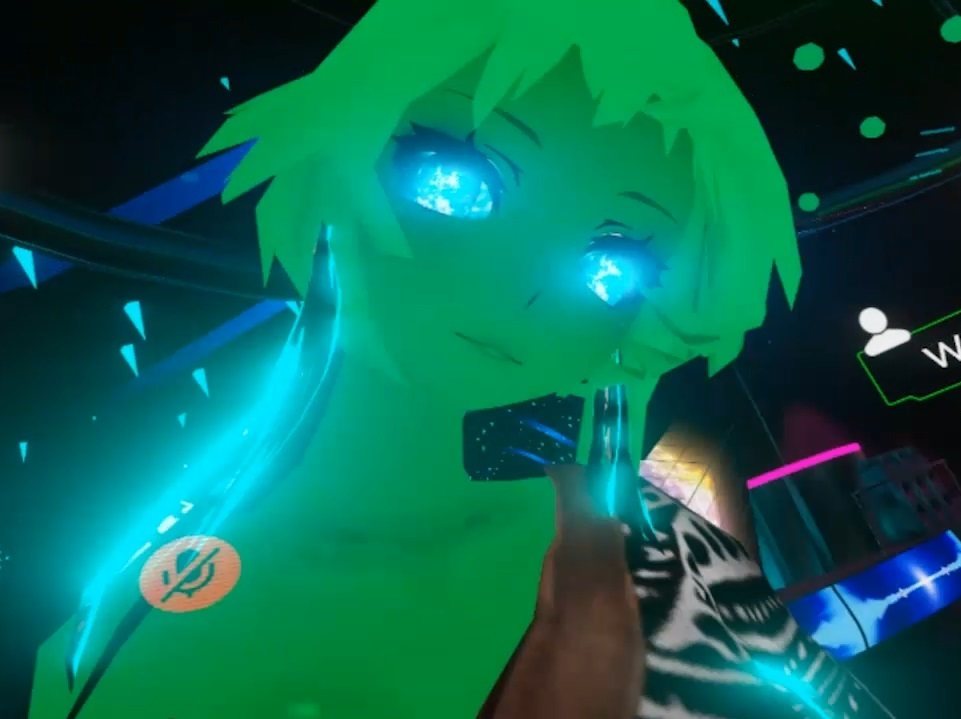

# VR ME

Found myself from 2018... Surprisingly also April.

___________

## Why it matters? 

It's a custom avatar, self-made in Unity. Uses Haku as a base model. Design, dynamic bones, physics, materials, effects: all has been readjusted to create a unique style.
And early VRChat had a lot of polygon count restrictions, so some areas has been reoptimised, making my model one of the highest qualities in the game at the time. 


[All polygons are in the areas that matter. It is a standart practice, but even right now I see people mention it as something new.]



People would say: you can look at fire, water and into my eyes forever. I did custom shader with a lot of small animations, so people would just sit and stare me into me eyes.
```
> eyes are made to resemble a surface of a blue sun
> moving, changing in a relaxing and tranquil way
> a great meditation partner even back then
```

This video below is actually a person added me on discord and said "Avatar is so beautiful, I started recording you mid session". That's how I got the video of different PoV to begin with.
Overall was a Void Club camper, video from that club as well: spent good months dancing my life away... Maybe time to go back to those days. Sadly my GPU is a tired granpa, maybe somewhen in the future.

Then I log into Genshin, guess who has my design? Ningguang is perry much it... not really, but close) [That's how I became the Geo guy day 1]

[video: tY_6MEc_TLc]
